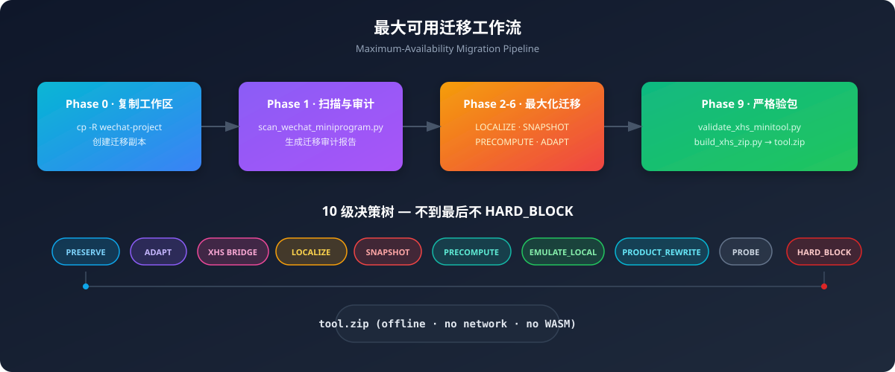
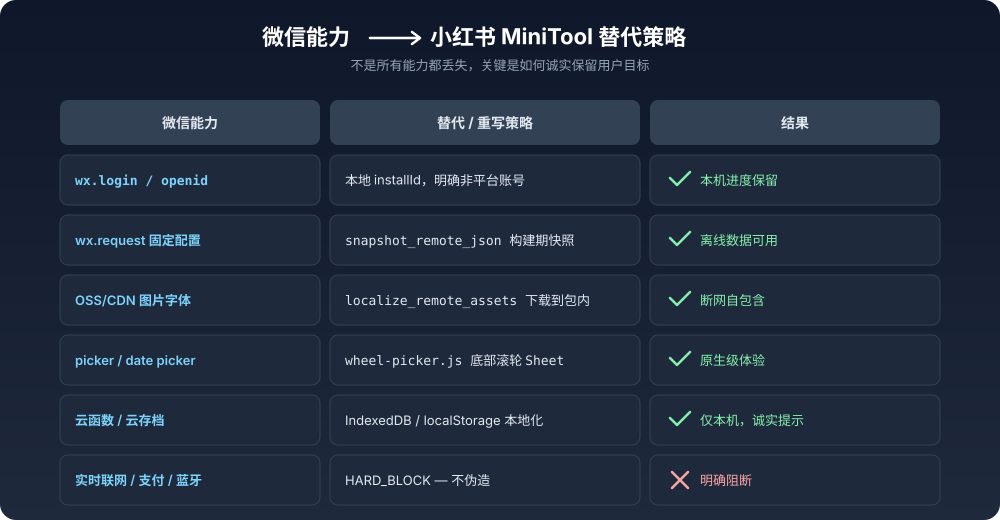

<p align="center">
  
</p>

<h1 align="center">
  <code>wechat-miniprogram-to-xhs-minitool</code>
</h1>

<p align="center">
  <b>微信小程序 / 微信小游戏 → 小红书 MiniTool 离线 H5 ZIP</b><br>
  <i>Maximum-Availability Migration Engine · 最大可用迁移引擎</i>
</p>

<p align="center">
  
  
  
  
  
</p>

<p align="center">
  <a href="#-核心原则">核心原则</a> ·
  <a href="#-快速开始">快速开始</a> ·
  <a href="#-迁移工作流">迁移工作流</a> ·
  <a href="#-能力替代矩阵">能力替代矩阵</a> ·
  <a href="#-脚本清单">脚本清单</a> ·
  <a href="#-架构决策树">架构决策树</a>
</p>

---

## 🎯 核心原则

> **不是“严格阻断优先”，而是“最大可用优先”。**

当微信小程序进入小红书 MiniTool 的严苛容器时，第一反应不应该是删除功能，而是追问：

```text
用户真正想完成的事，能否通过另一条诚实路径保留？
```

本引擎遵循 **10 级决策链**，把 `wx.request`、`wx.login`、云函数、广告、定位、分享等能力，依次尝试：

**PRESERVE → ADAPT → XHS BRIDGE → LOCALIZE → SNAPSHOT → PRECOMPUTE → EMULATE_LOCAL → PRODUCT_REWRITE → PROBE → HARD_BLOCK**

只有走到最后一级，才明确阻断。并且：

- ✅ 不伪造登录、支付、广告、实时服务端或平台身份
- ✅ 最终产物必须断网自包含
- ✅ 只使用官方当前 3 个 Native API：`postNote`、`saveImageToPhotosAlbum`、`writeTempFile`
- ✅ 严格验包，拒绝任何侥幸心理

<p align="center">
  
</p>

---

## 🚀 快速开始

### 环境要求

- Python 3.11+
- 一个待迁移的微信小程序或小游戏目录

### 一条命令上手

```bash
# 1. 扫描微信项目
python3 scripts/scan_wechat_miniprogram.py ./my-wechat-project \
  --out /tmp/xhs-audit

# 2. 生成最大可用执行计划
python3 scripts/generate_max_use_plan.py \
  /tmp/xhs-audit/migration-audit.json \
  -o /tmp/xhs-plan.md

# 3. 构建最终 MiniTool ZIP
python3 scripts/build_xhs_zip.py ./xhs-dist -o ./tool.zip
```

> 💡 完整迁移流程见 <a href="#-迁移工作流">迁移工作流</a> 与 `SKILL.md`。

---

## 🧬 迁移工作流

| Phase | 动作 | 关键脚本 / 模板 |
|------|------|----------------|
| **0** | 复制工作区，不破坏原项目 | `cp -R` / `--output-root` |
| **1** | 扫描与审计 | `scan_wechat_miniprogram.py` → `generate_max_use_plan.py` |
| **2** | 静态资源本地化 | `localize_remote_assets.py` |
| **3** | 固定数据快照 | `snapshot_remote_json.py` / `materialize_static_json.py` |
| **4** | 云函数拆解 | 客户端 JS / IndexedDB 替代 |
| **5** | 架构转换 | WXML→DOM · WXSS→CSS · setData→State · 小游戏→Canvas |
| **6** | 平台能力最大化替代 | `xhs-bridge.js` / `mini-compat.js` / `wheel-picker.*` |
| **7** | 可探测增强 | `capability-probe.js` |
| **8** | 构建产物约束检查 | 无网络 / 无 WASM / 无 Worker / 无 `eval` |
| **9** | 严格验包与打包 | `analyze_assets.py` → `validate_xhs_minitool.py` → `build_xhs_zip.py` |

---

## 🔄 能力替代矩阵

<p align="center">
  
</p>

| 微信能力 | 小红书 MiniTool 策略 | 结果 |
|---------|---------------------|------|
| `wx.login` / openid | 本地 `installId`，明确不是平台账号 | ✅ 本机进度保留 |
| `wx.request` 固定配置 | `snapshot_remote_json.py` 构建期快照 | ✅ 离线数据可用 |
| OSS/CDN 图片字体 | `localize_remote_assets.py` 下载到包内 | ✅ 断网自包含 |
| `picker` / `date picker` | `wheel-picker.js` 底部滚轮 Sheet | ✅ 原生级体验 |
| 云函数 / 云存档 | IndexedDB / localStorage 本地化 | ✅ 仅本机，诚实提示 |
| 实时联网 / 支付 / 蓝牙 | `HARD_BLOCK` — 不伪造 | ❌ 明确阻断 |

---

## 🛠️ 脚本清单

```bash
scripts/
├── scan_wechat_miniprogram.py      # 项目扫描与能力审计
├── generate_max_use_plan.py        # 生成最大可用执行计划
├── localize_remote_assets.py       # OSS/CDN 资源本地化
├── snapshot_remote_json.py         # 远程 JSON 构建期快照
├── materialize_static_json.py      # 本地 JSON 转 classic JS
├── embed_media_as_js.py            # 媒体文件 base64 内联 fallback
├── convert_rpx.py                  # rpx → px/rem 转换
├── analyze_assets.py               # 产物资源分析
├── validate_xhs_minitool.py        # MiniTool 离线合规校验
└── build_xhs_zip.py                # 打包 tool.zip
```

### 典型命令速查

```bash
# 扫描
python3 scripts/scan_wechat_miniprogram.py ./project --out /tmp/audit

# 执行计划
python3 scripts/generate_max_use_plan.py /tmp/audit/migration-audit.json -o /tmp/max-plan.md

# 静态资源本地化
python3 scripts/localize_remote_assets.py ./project \
  --host your-bucket.oss-cn-shanghai.aliyuncs.com \
  --output-root /tmp/xhs-work --apply

# 远程 JSON 快照
python3 scripts/snapshot_remote_json.py 'https://example.com/config.json' \
  --host example.com -o ./xhs-dist/assets/data/config.js --key config

# 已有 JSON 转 JS
python3 scripts/materialize_static_json.py ./config.json \
  -o ./xhs-dist/assets/data/config.js --key config

# 媒体被拦截时的实验 fallback
python3 scripts/embed_media_as_js.py ./tap.mp3 \
  -o ./xhs-dist/assets/data/media.js --key tap

# 验包与打包
python3 scripts/analyze_assets.py ./xhs-dist
python3 scripts/validate_xhs_minitool.py ./xhs-dist
python3 scripts/build_xhs_zip.py ./xhs-dist -o ./tool.zip
```

---

## 🌳 架构决策树

每个微信能力按以下顺序寻找方案，**不要一看到不等价就 HARD_BLOCK**：

```text
1. PRESERVE      标准 Web 可直接完成同一用户目标
2. ADAPT         改 API / DOM / Canvas / SPA / Storage 模型后可完成
3. XHS BRIDGE    postNote / saveImageToPhotosAlbum / writeTempFile 是否能保住目标
4. LOCALIZE      远程静态图片/字体/固定文件能否在迁移阶段放进 ZIP
5. SNAPSHOT      服务端内容是否其实是固定配置/关卡/词典，可构建期快照
6. PRECOMPUTE    WASM/Worker/在线处理是否输入有限，可构建期提前算好
7. EMULATE_LOCAL 账号/云存档/CRUD 是否只为本机体验，可改本地 installId + IndexedDB
8. PRODUCT_REWRITE 能否换一种交互达到相近用户目标
9. PROBE         官方未明确禁止的标准 Web 能力，feature-detect 后作为增强
10. HARD_BLOCK   原语义确实要求实时联网、真实支付、平台验证身份、硬件传感器等
```

---

## ⚡ MiniTool 原生体验适配

### 不重复绘制左上角返回键

MiniTool 容器自带返回控件。内部 SPA 用 `history.pushState / replaceState / popstate` 维护回退语义，不要把微信自绘的返回按钮原样搬进 MiniTool。

### 微信 Picker → 底部滚轮 Sheet

- 默认复用 `templates/wheel-picker.js` + `templates/wheel-picker.css`
- 5 行可视滚轮、56px 工具栏、18px 安全内边距
- 取消 / 确定 44px 点击热区
- 不使用系统原生 `<select>` 或 `<input type=date>` 作为主交互

### 微信 Date Picker → 年 / 月 / 日三列滚轮

- 月份/年份变化时动态修正天数与闰年
- 默认范围 `1970-01-01 ~ 2100-12-31`
- 确定后仍向原页面提供 `detail.value = YYYY-MM-DD`

---

## 🧪 可探测增强

把 `templates/capability-probe.js` 放入开发版本并引用：

```html
<script src="./assets/capability-probe.js"></script>
```

```js
if (MiniToolCapabilities.vibrateSymbol) {
  try { navigator.vibrate(20); } catch (_) {}
}
```

必须保证：无该能力时，核心流程仍然可用。

---

## 📦 产物规范

最终 `tool.zip` 必须满足：

- 一个 `index.html`
- 包内 HTML / CSS / classic JS
- 包内图片 / 字体 / 静态数据
- 标准 Web Canvas / WebGL / DOM / Storage / Media
- `window.xhs.miniTool` 的官方端能力
- **无网络请求** · **无 WASM** · **无 Worker** · **无 `eval` / `new Function`** · **无 iframe / object**

---

## 📚 参考文档

| 文档 | 说明 |
|-----|------|
| `SKILL.md` | 完整迁移规范与决策细节 |
| `references/xhs-current-capabilities.md` | 小红书 MiniTool 当前能力基线 |
| `references/wechat-to-xhs-capability-matrix.md` | 微信 ↔ 小红书能力对照表 |
| `references/migration-playbook.md` | 迁移操作手册 |
| `references/max-availability-strategy.md` | 最大可用策略详解 |
| `references/asset-localization.md` | 静态资源本地化规范 |
| `references/static-data-migration.md` | 静态数据迁移规范 |

---

## 🤝 贡献与许可

本项目采用 **MIT License**。

欢迎提交 Issue 与 PR，一起把“最大可用”做成行业默认答案。

<p align="center">
  <sub>Built with curiosity by <a href="https://github.com/litefreeteam">litefreeteam</a></sub>
</p>
